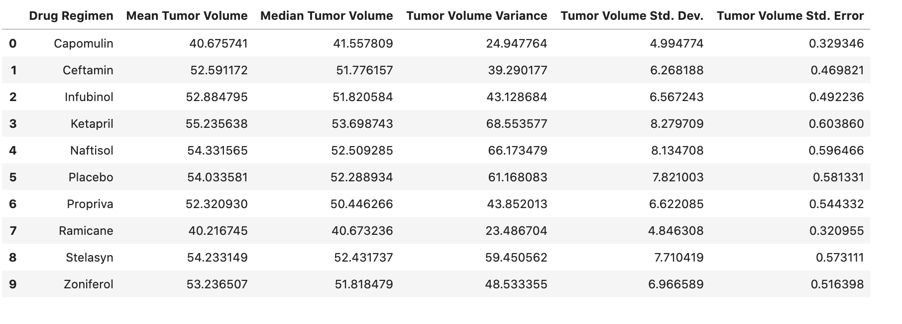
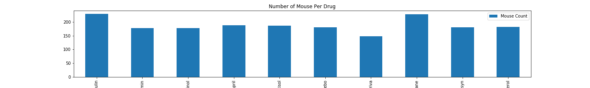
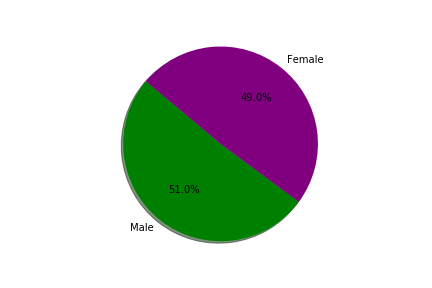
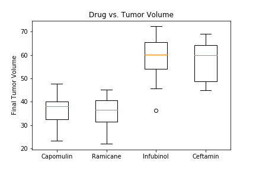
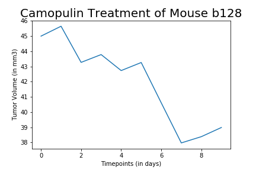
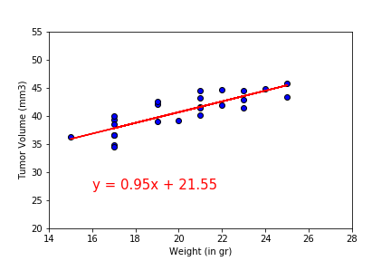

# Matplotlib-Challenge
I was given access to the complete data from their most recent animal study. In this study, 249 mice identified with SCC tumor growth were treated through a variety of drug regimens. Over the course of 45 days, tumor development was observed and measured. The purpose of this study was to compare the performance of Pymaceuticals' drug of interest, Capomulin, versus the other treatment regimens. You have been tasked by the executive team to generate all of the tables and figures needed for the technical report of the study. The executive team also has asked for a top-level summary of the study results.

## Paths for Analysis

* Before beginning the analysis, checked the data for any mouse ID with duplicate time points and removed any data associated with that mouse ID.
Using value_count of mouse_id, I identified that mouse with id g989 had more counts than other mice. Therefore, these duplicates were dropped to clean the data.

* Used the cleaned data for the remaining steps.

* Generated a summary statistics table consisting of the mean, median, variance, standard deviation, and SEM of the tumor volume for each drug regimen.
This how summary statistics look like:

* Generated a bar plot using both Pandas's `DataFrame.plot()` and Matplotlib's `pyplot` that shows  the number of total mice for each treatment regimen throughout the course of the study.

* Generated a pie plot using both Pandas's `DataFrame.plot()` and Matplotlib's `pyplot` that shows the distribution of female or male mice in the study.

* Calculated the final tumor volume of each mouse across four of the most promising treatment regimens: Capomulin, Ramicane, Infubinol, and Ceftamin. Calculated the quartiles and IQR and quantitatively determine if there are any potential outliers across all four treatment regimens. These calculations were later used to generate a box and whisker plot.

* Using Matplotlib, generated a box and whisker plot of the final tumor volume for all four treatment regimens and highlight any potential outliers in the plot by changing their color and style.

* Selected a random mouse with id b128 that was treated with Capomulin and generated a line plot of time point versus tumor volume for that mouse.

* Generated a scatter plot of mouse weight versus average tumor volume for the Capomulin treatment regimen. Calculated the correlation coefficient and linear regression model between mouse weight and average tumor volume for the Capomulin treatment. Plot the linear regression model on top of the previous scatter plot.

## Observations & Analysis

This experiment is about experimenting and analyzing the effect of 10 different drugs regimens on mice tumor volume. In this experiment, there are 248 mice of which  49% are female and 51% are male. The drug regimens were given over the course of maximum of 45 days. The close analysis were about mainly 4 drug regimens such as Capomulin, Ceftamin, Ramicane and Infubinol. Capomulin and Ramicane were given to the majority of the mice, with the count of 230 and 228 respecteviley.178 of the mice were treated with Infubinol and Ceftamin.If we look at the effect of these drugs on the tumor volume, infubinol and Ceftamin increased the averega of the final tumor volume for the final timepoint by about 5 mm3, while Capomulin and Ramicane decresed the average tumor volume from about 41 mm3 to 36 mm3. Therefore, among 4 of these drug regimens, Capomulin and Ramicane are the most effective drugs in redicung the size of the tumor volume. Also, analysis suggests that there is a positive correlation between tumor volume and mouse weight, with the correlation of 0.84.